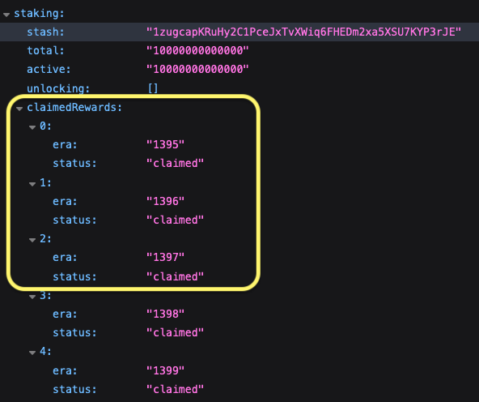
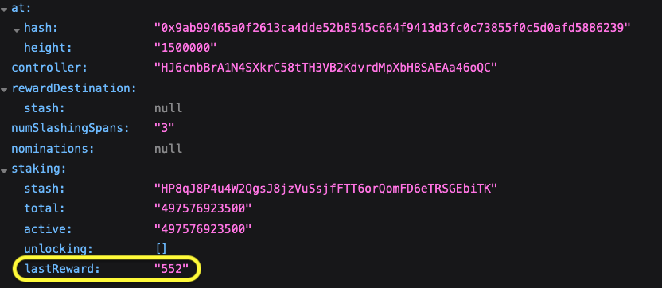
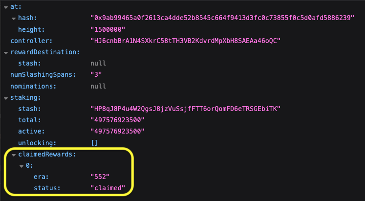

# Implementation Details of Claimed Rewards
This document outlines the implementation details for the `claimed` field returned by Sidecar's `/accounts/{accountId}/staking-info` endpoint (related [PR](https://github.com/paritytech/substrate-api-sidecar/pull/1445/files)).

Before proceeding, please check out the introductory helper guide in this [HackMd](https://hackmd.io/@LwMsxe3-SFmNXxugAXOKgg/ryPwFoezyl).

## Description
In Sidecar, the `/accounts/{accountId}/staking-info` endpoint ([docs](https://paritytech.github.io/substrate-api-sidecar/dist/)) takes two parameters: 
- a stash account (required field): this can be a validator's account or a nominator's account. 
- a block height (optional - default latest block): based on the height, the corresponding eras are returned.

One of the fields returned in the response by this endpoint is the `claimedRewards` information.

## `claimedRewards` field
The `claimedRewards` field shows the status of the rewards per era for the requested stash account, which can be either a validator or a nominator, at the requested block height. An example is shown in the screenshot below:



The **possible** rewards status values that can appear in every era vary based on whether it is a Validator or a Nominator account.
All valid status values are defined in the [AccountStakingInfo.ts](https://github.com/paritytech/substrate-api-sidecar/blob/master/src/types/responses/AccountStakingInfo.ts) file.

## Calls Checked
The calls we check to define if the queried Stash account claimed its rewards for the queried block/era are the following:
1. lastReward : `(stakingLedger as unknown as StakingLedgerTo240)?.lastReward`
2. legacyClaimedRewards : `stakingLedger?.legacyClaimedRewards`
3. `stakingLedger as unknown as StakingLedger)?.claimedRewards`
4. `query.staking.claimedRewards`

### Old Logic vs New Logic
At this point, it is important to mention the calls that correspond to the old logic vs the call of the new logic.
- The first three calls reflect the old logic, so they are used for queried eras prior to the implementation of the new logic. They are checked in the `fetchClaimedInfoFromOldCalls` function.
  - ✅ The code is the same regardless of whether the account is a validator or a nominator.
- The last call, `query.staking.claimedRewards`, which reflects the new logic for how rewards are claimed, can be found in `fetchAccountStakingInfo` and `fetchErasStatusForNominator` functions. 
  - ❗There are some important code differences depending on whether it is a validator or a nominator account.

**IMPORTANT NOTE**

In the following sections, we mention the old logic calls (1st & 2nd check), but the focus is primarily on the new logic (from the `query.staking.claimedRewards` call / 3rd check), explaining how it works and pinpointing the corresponding changes in the `StakingInfo` code.

### Eras & Depth
The aforementioned calls are closely related to the eras (_our starting era and the number of eras to check_) that we check the rewards for.
The initial calculation for `eraStart` (_our starting era_) and `depth` (_the number of eras to check_) happens in `fetchErasInfo` function. For this we use the `depth` and `current_era` information to calculate `eraStart`. Having that, we can start from `eraStart` until `eraStart + depth` and perform the checks mentioned in the following sections.

### Change of Eras to check
After the initial calculation, the eras we check can change in the `isOldCallsChecked` function.
First, we need to mention that the old calls are checked in the `fetchClaimedInfoFromOldCalls` function which returns `claimedRewardsEras` and `claimedRewards`. Then in `isOldCallsChecked` we check if `claimedRewardsEras` has any values and if yes then we take these values and populate the `claimedRewards` array in the new format of claimed response (`{era: ...,  status: ...}`). We might encounter some specific cases:
- The `eraStart` <= max length of `claimedRewardsEras` array: in this case we continue checking the eras from `claimedRewardsEras.length + 1` onwards.
- `depth == claimedRewardsEras.length`: in this case we do not need to check any further eras and we take the information that we already have.
- in all other cases we reset `claimedRewards` which means that we need to check if rewards were claimed for all eras from `eraStart` until `eraStart + depth` with the new call. This was added because for historical blocks we encountered the case where `eraStart` > max length of `claimedRewardsEras`. Then the algorithm would need to use the new call to get the claimed info but in these blocks it was not available. So, we would have no claimed info returned.


### 1st Check
In early blocks/eras, under `stakingLedger` there is `lastReward` instead of `claimedRewards`. In this case, we set as `claimed` the era mentioned in the `lastReward`.

**EXAMPLE**

If `lastReward` == `552` then we return in the response:
```
claimedRewards: [
  ...
  { 
    era: 552, 
    status : claimed 
  }
  ...
]
```

This is tested in the existing Kusama historical test (after it was updated accordingly) for:
- block height : 1500000 and 
- stash account : `HP8qJ8P4u4W2QgsJ8jzVuSsjfFTT6orQomFD6eTRSGEbiTK`

#### Field Name in Response
Before this change, when `lastReward` was available we were returning in the response the field named as `lastReward` instead of `claimedRewards`. ([Link](https://kusama-public-sidecar.parity-chains.parity.io/accounts/HP8qJ8P4u4W2QgsJ8jzVuSsjfFTT6orQomFD6eTRSGEbiTK/staking-info?at=1500000))





This has been changed so that we always have the same name in the specific field of the response, `claimedRewards` and of course the structure 





### 2nd Check
- If `stakingLedger.legacyClaimedRewards` call is available, retrieve `claimed` information from that call
- If **not**, retrieve `claimed` info from `stakingLedger.claimedRewards`
- The resulting output is an array of all eras claimed up to that block height which we then transformed into the final output format which is an array of objects of type:

```
claimedRewards: [
  ...
  { 
    era: eraNumber, 
    status : claimed 
  }
  ...
]
```

**NOTE** : The 2 calls mentioned above are per specific block height and stash account.

### 3rd Check
Then, independently of the previous check, check also:
- If `query.staking.claimedRewards` call is available
	- If yes, then retrieve the `claimed` information from that call but only for the eras that we are still missing and complete the missing info.
	- If the call is not available, no additional check is performed beyond the previous check.

**NOTE 1** : this call is per specific block height, era and stash account.

**NOTE 2** : the logic changes slightly depending on whether the queried account is a validator (`fetchErasStatusForValidator` function) or a nominator (`fetchErasStatusForNominator` function).

## Logic per Account Type
First we need to check if the stash account queried is a Validator or a Nominator on the specified era.

### Validator Account
If the account queried in the endpoint is a `validator` account, the logic implemented is described in the following subsections.

#### 💰 Reward Types
A validator receives two types of reward:
1. the reward for their own stake/contribution
1. the reward(s) for the commission(s)
    
##### Reward for own stake
This is paid in the first page.

##### Reward(s) for commission(s)
A validator can have one or more pages displaying its nominators. For each page, the validator receives a commission so the total commission is the sum of the commissions from all pages. Hence the total commission is paid out when all pages are claimed.

❓Why the total commission is not paid out all at once but in parts/per page?
- So that the validator has incentive to pay out all the pages.

#### 🚦 Possible status values
The possible reward status values of `claimed` for a Validator account are the following:
- `unclaimed`
- `partially claimed`
- `claimed`
- `undefined`

#### Setting the Status for Each Era
Here is how each of the above statuses is determined for each era. To make it easier, let's assume that a validator has 3 pages of nominators.

#### status: `unclaimed`
If in the queried era, no page is claimed then the status of this era is `unclaimed`.

#### status: `partially claimed`
If in the queried era, only the first page of nominators is claimed (so page `0`, since page indexing starts from `0`), this means the following:
- two types of rewards are claimed: the "_reward of validator's own stake_" + "_reward from first page commission_".
- so one out of the three pages are claimed.
- so the status of this era is `partially claimed` since there are two more pages to be claimed still.

If in the queried era, the first AND the second page is claimed, this means:
- only the "_reward from second page commission_" is paid out. The reward for the validator's own stake is disregarded (relevant code [here](https://github.com/paritytech/polkadot-sdk/blame/master/substrate/frame/staking/src/lib.rs#L1115)) since it was paid when the first page was claimed.
- the status is still `partially claimed` since there is one more page to be claimed.

#### status: `claimed`
If in the queried era, all nominators pages are claimed (so in our example all three pages):
- the status of the era is `claimed`

#### Status recap
So, for a validator's rewards we have 3 potential statuses (with the new calls):
- `unclaimed` if no pages were claimed.
- `partially claimed` if some of the pages were claimed.
- `claimed` if all pages of `erasStakersPaged` were claimed.
- `undefined` if we are referring in early eras where we cannot define if the reward was claimed.

#### Logic implemented in the code
This code can be found in the `fetchErasStatusForValidator` function. For each era:
- If `staking.erasStakersOverview.pageCount` == `query.staking.claimedRewards` -> then we set the queried era as `claimed`
- If `staking.erasStakersOverview.pageCount` != `query.staking.claimedRewards. length` -> we set the era as  `partially claimed`
- If `overview == null` && `erasStakers > 0` -> this means that `pageCount` = 1
  - so then it depends again on the `query.staking.claimedRewards` value to see if era `claimed` or `unclaimed`.
- The resulting output is the same as in the 1st check, e.g. `{ "era": "6453", "status": "claimed" },`
*** _Note : the output from `query.staking.claimedRewards` is of format `[0]` if only one page was claimed or `[0, 1]` if 2 pages were claimed depending on how many pages the stakers of the specific validator are split into (shown from `staking.erasStakersOverview.pageCount`)._

#### Useful Resource
The payout for the validator in polkadot-sdk codebase is done [here](https://github.com/paritytech/polkadot-sdk/blob/776e95748901b50ff2833a7d27ea83fd91fbf9d1/substrate/frame/staking/src/pallet/impls.rs#L357).


### Nominator Account
If the account queried in the endpoint is a `nominator` account, the logic is implemented in the `fetchErasStatusForNominator` function. As mentioned in the code's comments, to verify the reward status `claimed` of an era for a Nominator's account, we need to check the status of that era in one of their associated Validators' accounts. The logic is implemented in the . The function's comments describe most of the steps/checks implemented there.

#### 💰 Reward Types
A nominator receives one type of reward:
1. the reward for their own stake/contribution

#### 🚦 Possible status values
The possible rewards status values of `claimed` for a Nominator account are the following:
- `unclaimed`
- `claimed`
- `undefined`

## Different Cases
### Case  `staking.erasStakersOverview.pageCount` == `staking.claimedRewards.length`
This is the case when
- Validator has 
	- 1 or more pages of nominators (`erasStakersOverview` -> `pageCount`) per era and 
	- these pages are equal to the length of the contents found in `claimedRewards` array
### Example
- Account `DteShXKaQQy2un2VizKwwhViN5e7F47UrkAZDkxgK22LdBv` - [subscan](https://kusama.subscan.io/validator/DteShXKaQQy2un2VizKwwhViN5e7F47UrkAZDkxgK22LdBv?tab=reward)
- Era `6577` in Kusama chain
- at block = `23032300`
- block hash = `0xf9362e71ed123c3a057b75bce389a4c0758ad405556125fee00529569a433898`
- [pjs apps](https://polkadot.js.org/apps/?rpc=wss%3A%2F%2Fkusama-rpc.dwellir.com#/chainstate) 
	- `staking.claimedRewards` = `[0]`
	- `staking.erasStakersOverview.pageCount` = `1`


- Sidecar `http://127.0.0.1:8080/accounts/DteShXKaQQy2un2VizKwwhViN5e7F47UrkAZDkxgK22LdBv/staking-info?at=23032300`
	- Era `6577` - Claimed
### Case Handled
This case is handled by setting queried era as claimed.

### Case  `staking.erasStakersOverview.pageCount` != `staking.claimedRewards.length`
This is the case when a validator has multiple pages of nominators and only some of these pages were claimed. 
### Example
- Account [11VR4pF6c7kfBhfmuwwjWY3FodeYBKWx7ix2rsRCU2q6hqJ](https://polkadot.subscan.io/validator/11VR4pF6c7kfBhfmuwwjWY3FodeYBKWx7ix2rsRCU2q6hqJ?tab=reward)
- Era `1470` in Polkadot chain
- [pjs apps](https://polkadot.js.org/apps/?rpc=wss%3A%2F%2Frpc.dotters.network%2Fpolkadot#/chainstate) 
	- era `1468`
	- at block = 21157800
	- block hash = `0x59de258cf9999635c866df7bc5f397d152892827f887d3629344cb3cebba134f`
- claimedRewards = `[0]`
- erasStakersOverview = 2

- Sidecar `http://127.0.0.1:8080/accounts/11VR4pF6c7kfBhfmuwwjWY3FodeYBKWx7ix2rsRCU2q6hqJ/staking-info?at=21157800`
	- Era `1468` - `Partially Claimed`

### Case handled
This case is handled currently by setting queried era as **partially claimed**.

### Case  `staking.erasStakersOverview` = `null` & `staking.claimedRewards` = `[0]`
This is a case where `staking.erasStakersOverview` is `null` so the information about the `pageCount` (in how many pages the stakers are divided into) needs to be retrieved from `erasStakers` and then compare it with `staking.claimedRewards`.
### Example
- Account [F2VckTExmProzJnwNaN3YVqDoBPS1LyNVmyG8HUAygtDV3T](https://kusama.subscan.io/reward?address=F2VckTExmProzJnwNaN3YVqDoBPS1LyNVmyG8HUAygtDV3T&role=validator&category=Reward&page=9)
- [pjs apps](https://polkadot.js.org/apps/?rpc=wss%3A%2F%2Frpc.dotters.network%2Fpolkadot#/chainstate) 
	- era `6513` in Kusama chain
	- at block = 22939322
	- block hash = `0x1ef674fffb042c9016987e0e3995a36401a7e2b66e0b6c0bb111a0b049857098`
- claimedRewards = `[0]`
- erasStakersOverview = `null`


- Sidecar `http://127.0.0.1:8080/accounts/F2VckTExmProzJnwNaN3YVqDoBPS1LyNVmyG8HUAygtDV3T/staking-info?at=22939322`
	- Era `6513` - `Claimed`

### Case handled
This case is handled by checking if `erasStakers > 0` (hence pageCount == 1) && `staking.claimedRewards` is equal to `[0]` (hence length is 1) -> which is true for era `6513` so era is set to `claimed`.

### Case  `staking.erasStakersOverview` = `null` & `erasStakers` = 0
Based on this [comment](https://github.com/polkadot-js/api/issues/5859#issuecomment-2077011825), exposure is not found so we cannot conclude in a status for this specific era. An example is the below request in which only 48 eras are returned since for the rest 36 -> `staking.erasStakersOverview` = `null` & `erasStakers` = 0.

### Response (old code)
`http://127.0.0.1:8080/accounts/CmjHFdR59QAZMuyjDF5Sn4mwTgGbKMH2cErUFuf6UT51UwS/staking-info?at=22869643`

```
{
  "at": {
    ...
    ...
  "staking": {
    ...
    ...
    "legacyClaimedRewards": [
      "6462",
      "6463",
      "6467",
      "6468",
      "6469",
      "6470",
      "6471",
      "6472",
      "6473",
      "6474",
      "6495",
      "6496",
      "6497",
      "6498",
      "6499",
      "6503",
      "6504",
      "6505",
      "6506",
      "6507",
      "6508",
      "6509",
      "6510",
      "6511",
      "6512"
    ]
  }
}
```

### Response (new code)
```
{
  "at": {
    "hash": "0xa43364b7a138ec47bd80f09e480a1599f622405add19c6c0913624ab0bb0a96e",
    "height": "22869643"
    ...
    ...
  "staking": {
    ...
    ...
    "claimedRewards": [
      {
        "era": "6462",
        "status": "claimed"
      },
      {
        "era": "6463",
        "status": "claimed"
      },
      {
        "era": "6467",
        "status": "claimed"
      },
      {
        "era": "6468",
        "status": "claimed"
      },
      {
        "era": "6469",
        "status": "claimed"
      },
      {
        "era": "6470",
        "status": "claimed"
      },
      {
        "era": "6471",
        "status": "claimed"
      },
      {
        "era": "6472",
        "status": "claimed"
      },
      {
        "era": "6473",
        "status": "claimed"
      },
      {
        "era": "6474",
        "status": "claimed"
      },
      {
        "era": "6495",
        "status": "claimed"
      },
      {
        "era": "6496",
        "status": "claimed"
      },
      {
        "era": "6497",
        "status": "claimed"
      },
      {
        "era": "6498",
        "status": "claimed"
      },
      {
        "era": "6499",
        "status": "claimed"
      },
      {
        "era": "6503",
        "status": "claimed"
      },
      {
        "era": "6504",
        "status": "claimed"
      },
      {
        "era": "6505",
        "status": "claimed"
      },
      {
        "era": "6506",
        "status": "claimed"
      },
      {
        "era": "6507",
        "status": "claimed"
      },
      {
        "era": "6508",
        "status": "claimed"
      },
      {
        "era": "6509",
        "status": "claimed"
      },
      {
        "era": "6510",
        "status": "claimed"
      },
      {
        "era": "6511",
        "status": "claimed"
      },
      {
        "era": "6512",
        "status": "claimed"
      },
      {
        "era": "6513",
        "status": "claimed"
      },
      {
        "era": "6514",
        "status": "claimed"
      },
      {
        "era": "6515",
        "status": "claimed"
      },
      {
        "era": "6516",
        "status": "claimed"
      },
      {
        "era": "6517",
        "status": "claimed"
      },
      {
        "era": "6518",
        "status": "claimed"
      },
      {
        "era": "6519",
        "status": "claimed"
      },
      {
        "era": "6520",
        "status": "claimed"
      },
      {
        "era": "6521",
        "status": "claimed"
      },
      {
        "era": "6522",
        "status": "claimed"
      },
      {
        "era": "6523",
        "status": "claimed"
      },
      {
        "era": "6524",
        "status": "claimed"
      },
      {
        "era": "6525",
        "status": "claimed"
      },
      {
        "era": "6526",
        "status": "claimed"
      },
      {
        "era": "6527",
        "status": "claimed"
      },
      {
        "era": "6528",
        "status": "unclaimed"
      },
      {
        "era": "6529",
        "status": "unclaimed"
      },
      {
        "era": "6530",
        "status": "unclaimed"
      },
      {
        "era": "6531",
        "status": "unclaimed"
      },
      {
        "era": "6532",
        "status": "unclaimed"
      },
      {
        "era": "6533",
        "status": "unclaimed"
      },
      {
        "era": "6534",
        "status": "unclaimed"
      },
      {
        "era": "6535",
        "status": "unclaimed"
      }
   ]
  }
}
```


### Testing
- [x] Tested for account and blocks that include the eras before and after the migration (when the logic changed).

### 🗒️ Implementation Notes
- ‼️ The response time of the endpoint is significantly slower now.
   - Possible Solution : Add a query parameter as flag to enable or not the claimed rewards. It can default to `true` so that it does not break the current functionality of the endpoint. Implementation in a separate PR.
- I use current era (and not active era) to calculate the depth.
- The total of eras returned are equal to the current depth. Depending on the calls available it is either : 
   - `current era - depth` if only the new calls are available or
   - `array.length` from result of old calls up until depth. So if `array.length` = 20 and `depth` = 84, we will check 64 more eras after the last era found in the array (from the old calls). 
